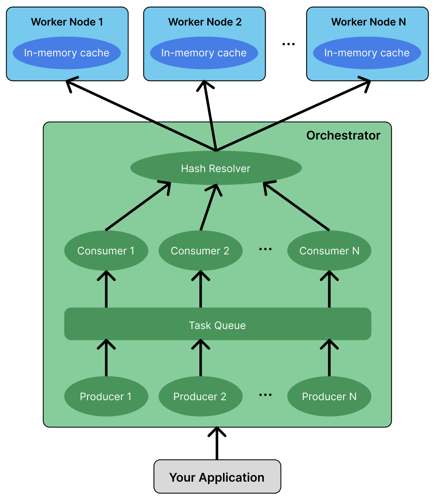

# Echo Cache

## Introduction

Echo cache is a distributed in-memory caching solution prioritizing performance and simplicity. This project was created to explore distributed systems, networking, and architectural design.

### Goals for this cache

-   **Highly consistent and partition tolerant**: In the [CAP theorem](https://en.wikipedia.org/wiki/CAP_theorem), prioritize C and P.
-   **Fault tolerant**: The cache can still function and recover if any worker nodes fail.
-   **Performance**: Designed to be highly performant without bottlenecks.

## Usage

You will need to run multiple workers, one orchestrator, then your application which uses the cache.

1. Build the project.

```bash
mkdir build
cd build
cmake ..
make
```

2. Run the workers. In this case, we will be running 2 workers.

```bash
# In shell 1.
./build/worker/worker <worker1 port>
# In shell 2.
./build/worker/worker <worker2 port>
```

3. Run the orchestrator. In this case, we are assuming we have 2 workers.

```bash
# In shell 3
./build/orchestrator/orchestrator <orchestrator port> <worker1 ip> <worker1 port> <worker2 ip> <worker2 port>
```

4. Run the client program. You can also run the CLI tool for testing as shown here.

```bash
# In shell 4
./build/clients/commandline <orchestrator ip> <orchestrator port>
```

### Concrete Example

```bash
# In shell 1.
./build/worker/worker 3000
# In shell 2.
./build/worker/worker 3001
# In shell 3
./build/orchestrator/orchestrator 8000 127.0.0.1 3000 127.0.0.1 3001
# In shell 4
./build/clients/commandline 127.0.0.1 8000

Type a command:
 1. set <key> <value>
 2. get <key>
 3. quit

>>> set name tanson
Success

>>> get name
Response (0): 'tanson'
```

## Use cases

-   this cache is right for you if...
-   Use it as a layer between db and server
-   sharing values across sharded servers

## Architecture



### Worker

### Orchestrator

### Fault Tolerance

### Custom Network Protocol

## Storage Engine

-   orchestrator-worker architecture
-   Orchestrator: every request and response goes through the orchestrator. The orchestrator directs responses to workers. Basically a load balancer/proxy
-   Worker: Does the work of actually storing/retrieving data.
-   Fault tolerance: when a node comes back up, automatically fill all its information from it's partner node.
-   Each node has a partner node that contains all the same data.
-   On each request, send data to a node and its partner.

Talk about

-   architecture
-   the custom networking protocol
-   the implementation of the in memory cache itself
    -   compress the data first
-   the fault tolerance (storing on multiple instances and fetching from multiple instances)
-   durability, persistance,
