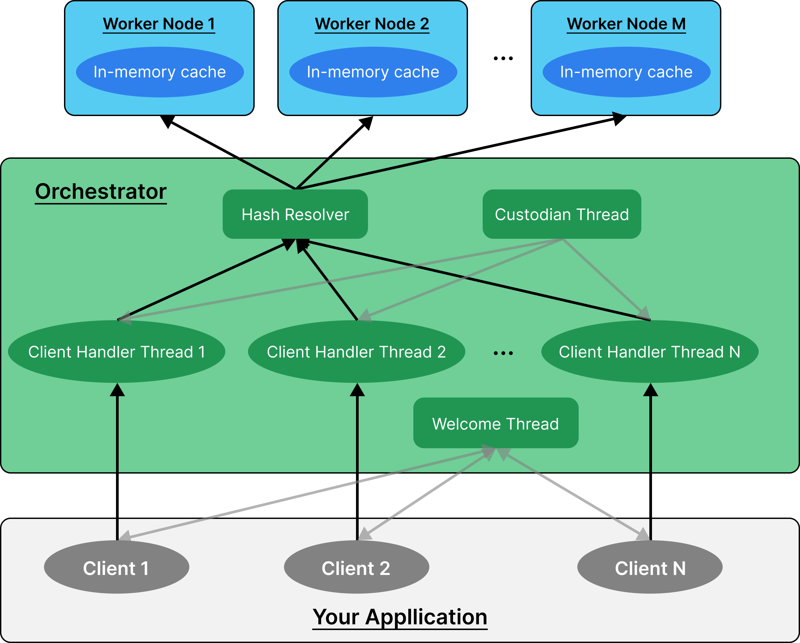

# Remote Cache

## Ideas

-   think about compression
-   think about encryption
-   think about multi threading and handling multiple request at once

## Goals

-   In relation to the CAP theorem, prioritize availability and partition tolerance
-   Simple
-   Easy client interface

## Architecture



-   orchestrator-worker architecture
-   Orchestrator: every request and response goes through the orchestrator. The orchestrator directs responses to workers. Basically a load balancer/proxy
-   Worker: Does the work of actually storing/retrieving data.
-   Fault tolerance: when a node comes back up, automatically fill all its information from it's partner node.
-   Each node has a partner node that contains all the same data.
-   On each request, send data to a node and its partner.

## Usage

-   Start up each worker and note the information it outputs
-   Start up the orchestrator and feed it the worker information

## Configurations

-   None for now

## Orchestrator Architecture

-   When receives a connection request, spin up a thread to handle that connection
    -   Keep the connection open until the client closes it through closing it on their end or sending "exit"
    -   When it receives a request, process it and return a response. Also update the "last request at"
-   Have a care-taker thread that just goes through all of the threads "last request at" times and kills those that have not had activity in a certain period of time.

## Orchestrator and Worker API

```
### Request Format.
request = get||<string>
        | set||<string>||<string>

### Response Format.
response = 0||<result>
         | <error_code>||<error>

error_code = 1 // parsing failure
            | 2 // key not found
            | 3 // invalid command type

result = <string> // the value for a get request or empty for a set request
error = <string> // error message
```

## Orchestrator Usage

```
./orchestrator <ip 1> <port 1> <ip 2> <port 2> ... <ip n> <port n>
```

Talk about

-   architecture
-   the custom networking protocol
-   the implementation of the in memory cache itself
    -   compress the data first
-   the fault tolerance (storing on multiple instances and fetching from multiple instances)
-
